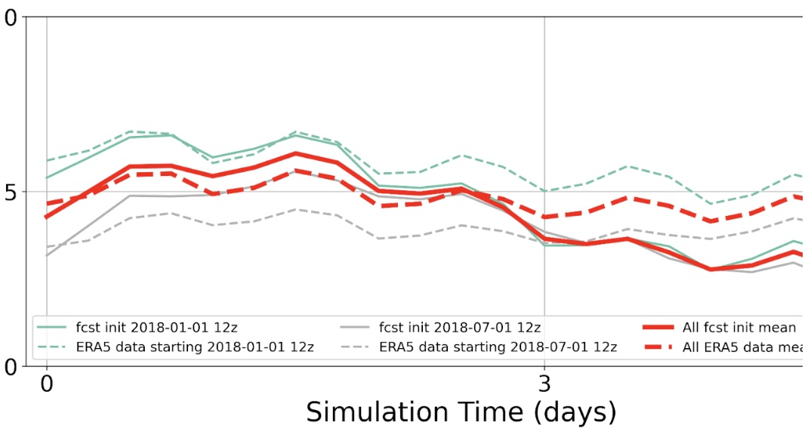
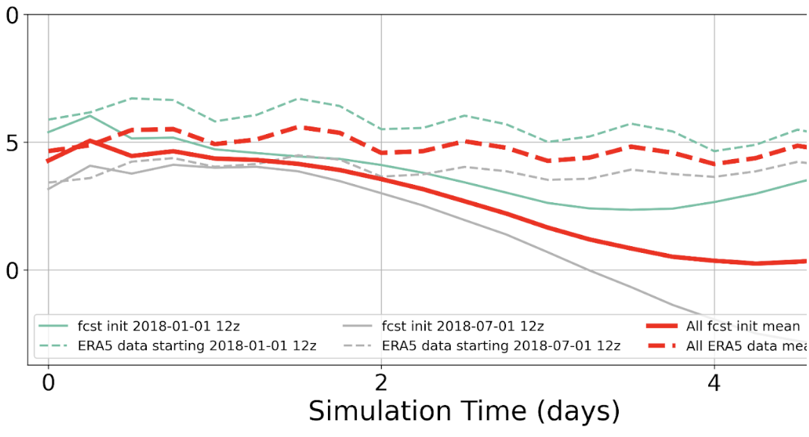
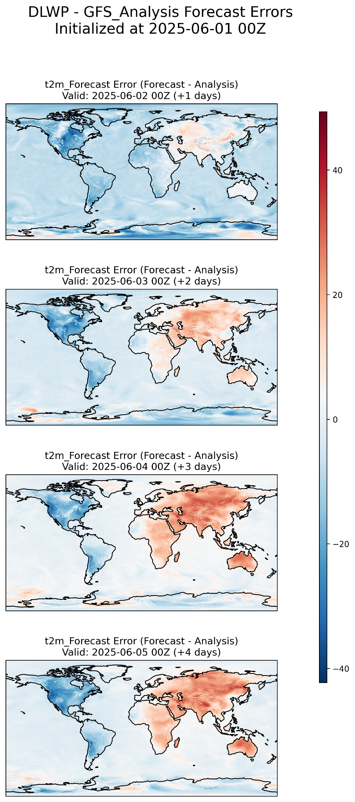

# DCMIP 2025

Repository: https://github.com/taobrienlbl/DCMIP2025-ML

Workshop website: https://sites.google.com/umich.edu/dcmip-2025

My group's results: https://sites.google.com/umich.edu/dcmip-2025/workshop-results/ml-group

---

### What is DCMIP?

DCMIP, which stands for Dynamical Core Model Intercomparison Project, is a workshop held at roughly four years intervals since 2012 (excepting 2020 for obvious reasons). Its organizers invite career model developers, university professors, post-docs, and graduate students to come together for 1-2 weeks and explore the capabilities and weaknesses of different weather models in small groups. It also holds lectures throughout the workshop to explain the design decisions of those weather models, which is extremely useful to graduate students like myself who've had few classes in numerical weather prediction (NWP). 

### Why did DCMIP care about AI?

In the 2012 and 2016 DCMIP meetings, the focus was on physics-based weather models because no other kind was yet popular. But starting in the early 2020's, a slow, trickling release of new artifical intelligence (AI)-based weather models turned into a steady stream. These models use massive datasets generated by physics-based weather models to learn the patterns of weather surprisingly well. Today they seem poised to enter every area in atmospheric science, from the operational weather forecasts that end up on your phone to the models that make headline-grabbing climate projections. But after a model is released, the rest of the scientific community buzzes with questions, like: What can the model be used for? How does it work? What are its failure modes? DCMIP has a history of answering these questions for physics-based weather models, so they thought, "Why not examine AI models?" 

### The AI working group team

Months before the summer workshop, DCMIP's organizers invited my advisor, Dr. Travis O'Brien, and I to lead a new working group, one that would search for answers to the questions listed above. While I spearheaded development of the experimental framework used by our ~10 person group at DCMIP, I'm grateful to have had both hands-on help and more abstract guidance from Travis and two of the DCMIP organizers, Dr. Christiane Jablonowski and her PhD candidate Garrett Limon. 

### Our group's results

The codebase we wrote for DCMIP25's AI Working Group can be found at the top of the page. Due to an unforeseen computational outage on NCAR's supercomputer we were unable to complete all of the experiments we prepared, but the participants in our group were all able to set up the environment and run simple experiments within the first day of the workshop. Below I describe one quantitative and one qualitative result from the workshop. 

#### Result 1: Importance of GPU/CPU Choice for Weather Trends

Of all the findings during the workshop, this one surprised me most. When running Google's operational deterministic model, GraphCast, we found that the model showed different trends in global atmospheric pressure depending on whether we ran the model on GPU or CPU.

The GPU trend (first image below) in forecasted global pressure (solid red line) shows exactly what we would expect: a 24-hour cycle matching the model training data (ERA5). The CPU trend (second image below), however, has no visible diurnal cycle.

My interpretation is that the small differences in numerical precision between GPU and CPU, applied millions or billions of times during inference, lead to dramatic differences in model behavior. If so, I think we need more research into possible consequences. The CPU's smoothing of the diurnal trend suggests a worse forecast to me, which would push me to use GPU for any important applications of this model. 

Of course, it is possible this is a bug in the experimental code; workshops are hectic and I haven't tried to reproduce the result. For now, it remains an interesting topic for exploration.

#### Result 2: AI models are easy to set up

When the HPC systems at NCAR went down in the second day of the workshop, it put a serious damper on the event. How could we run a bunch of complex, compute-intensive models (both physics- and AI-based) with no supercomputer? The rest of the groups were able to move to backup compute resources, but our group took a different tack: running the models locally. 

It's a testament to the talent of the developers at NVIDIA's [Earth2Studio](https://github.com/NVIDIA/earth2studio) that most of the group members were able to download, install, run, and analyze the output of at least one AI model on their own computers. NWP models are simply too expensive to run locally, so AI models may prove invaluable for teaching weather forecasting in compute-constrained environments. Many of our group's members were grateful for the opportunity to learn more about these models so that they could use them in future work. Some forecasts made locally by group members are shown below. 

